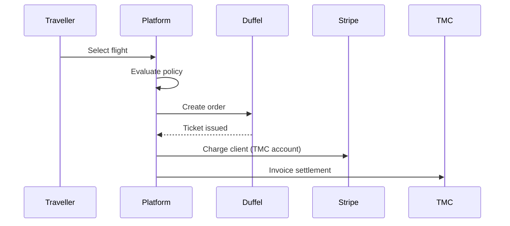
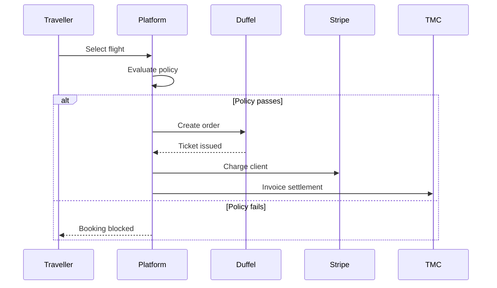
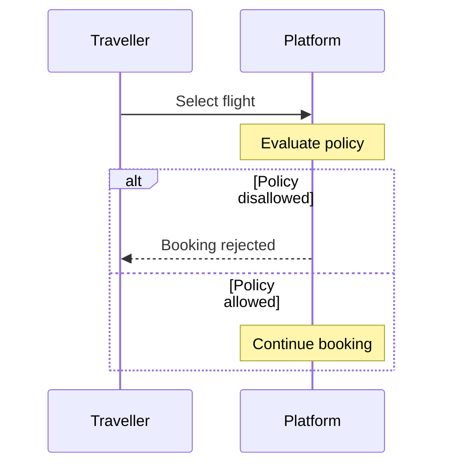
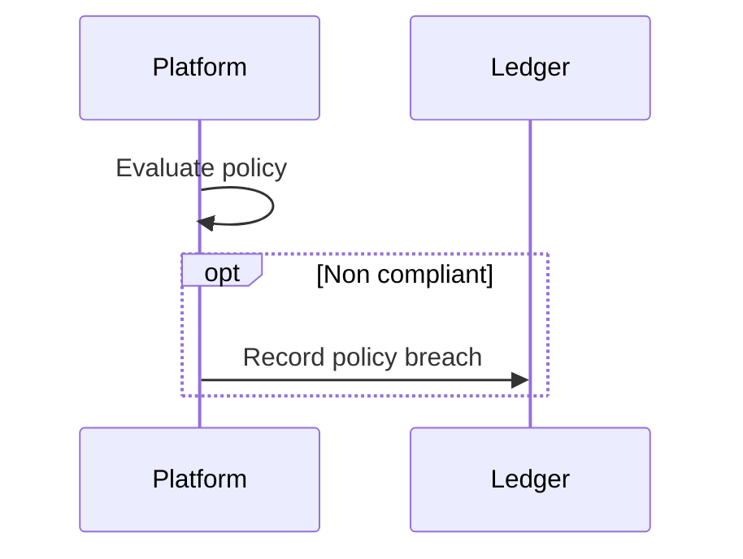
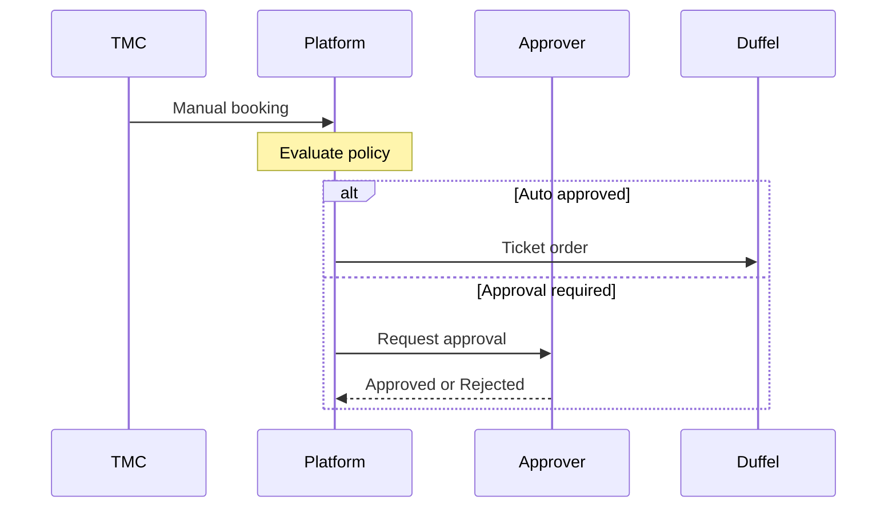
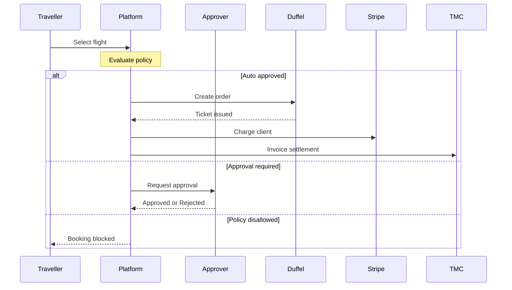
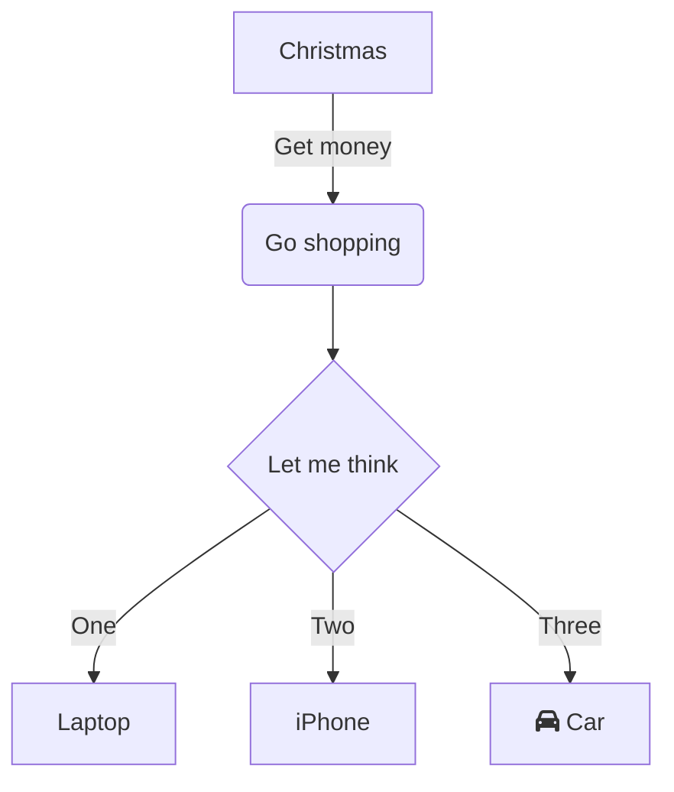
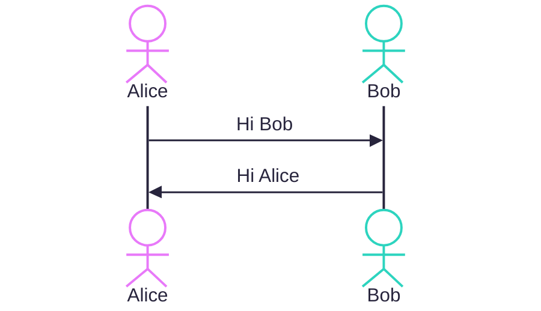
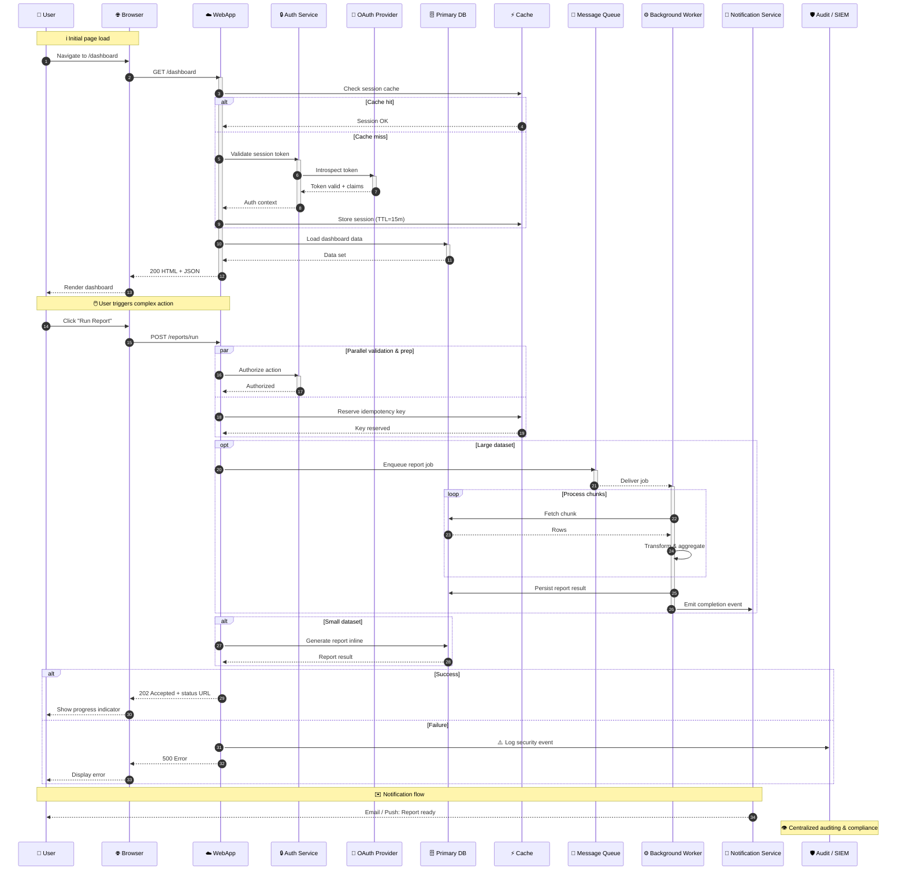

## Diag 1

```mermaid
sequenceDiagram
  participant Traveller
  participant Platform
  participant Duffel
  participant Stripe
  participant TMC

  Traveller->>Platform: Select flight
  Platform->>Platform: Evaluate policy
  Platform->>Duffel: Create order
  Duffel-->>Platform: Ticket issued
  Platform->>Stripe: Charge client (TMC account)
  Platform->>TMC: Invoice settlement
```

## Diag 2

```mermaid
sequenceDiagram
  participant Traveller
  participant Platform
  participant Duffel
  participant Stripe
  participant TMC

  Traveller->>Platform: Select flight
  Platform->>Platform: Evaluate policy

  alt Policy passes
    Platform->>Duffel: Create order
    Duffel-->>Platform: Ticket issued
    Platform->>Stripe: Charge client
    Platform->>TMC: Invoice settlement
  else Policy fails
    Platform-->>Traveller: Booking blocked
  end
```

## Diag 3

```mermaid
sequenceDiagram
  participant Traveller
  participant Platform

  Traveller->>Platform: Select flight
  note over Platform: Evaluate policy

  alt Policy disallowed
    Platform-->>Traveller: Booking rejected
  else Policy allowed
    note over Platform: Continue booking
  end
```

## Diag 4

```mermaid
sequenceDiagram
  participant Platform
  participant Ledger

  Platform->>Platform: Evaluate policy

  opt Non compliant
    Platform->>Ledger: Record policy breach
  end
```

## Diag 5

```mermaid
sequenceDiagram
  participant TMC
  participant Platform
  participant Approver
  participant Duffel

  TMC->>Platform: Manual booking
  note over Platform: Evaluate policy

  alt Auto approved
    Platform->>Duffel: Ticket order
  else Approval required
    Platform->>Approver: Request approval
    Approver-->>Platform: Approved or Rejected
  end
```

## Diag 6

```mermaid
sequenceDiagram
  participant Traveller
  participant Platform
  participant Approver
  participant Duffel
  participant Stripe
  participant TMC

  Traveller->>Platform: Select flight
  note over Platform: Evaluate policy

  alt Auto approved
    Platform->>Duffel: Create order
    Duffel-->>Platform: Ticket issued
    Platform->>Stripe: Charge client
    Platform->>TMC: Invoice settlement

  else Approval required
    Platform->>Approver: Request approval
    Approver-->>Platform: Approved or Rejected

  else Policy disallowed
    Platform-->>Traveller: Booking blocked
  end
```

```mermaid
flowchart TD
    A[Christmas] -->|Get money| B(Go shopping)
    B --> C{Let me think}
    C -->|One| D[Laptop]
    C -->|Two| E[iPhone]
    C -->|Three| F[fa:fa-car Car]
```

```mermaid
---
config:
  theme: redux-color
---
sequenceDiagram
        actor Alice
        actor Bob
        Alice->>Bob: Hi Bob
        Bob->>Alice: Hi Alice
```

```mermaid
sequenceDiagram
autonumber

  participant U as 👤 User
  participant B as 🌐 Browser
  participant W as ☁️ WebApp
  participant A as 🔒 Auth Service
  participant G as 🔑 OAuth Provider
  participant P as 🗄️ Primary DB
  participant C as ⚡ Cache
  participant Q as 🔁 Message Queue
  participant S as ⚙️ Background Worker
  participant N as 🔔 Notification Service
  participant E as 🛡️ Audit / SIEM


Note over U,B: ℹ️ Initial page load

U->>B: Navigate to /dashboard
B->>W: GET /dashboard
activate W

W->>C: Check session cache
alt Cache hit
    C-->>W: Session OK
else Cache miss
    W->>A: Validate session token
    activate A
    A->>G: Introspect token
    activate G
    G-->>A: Token valid + claims
    deactivate G
    A-->>W: Auth context
    deactivate A
    W->>C: Store session (TTL=15m)
end

W->>P: Load dashboard data
activate P
P-->>W: Data set
deactivate P

W-->>B: 200 HTML + JSON
deactivate W
B-->>U: Render dashboard

Note over U,W: 🖱️ User triggers complex action

U->>B: Click "Run Report"
B->>W: POST /reports/run
activate W

par Parallel validation & prep
    W->>A: Authorize action
    activate A
    A-->>W: Authorized
    deactivate A
and
    W->>C: Reserve idempotency key
    C-->>W: Key reserved
end

opt Large dataset
    W->>Q: Enqueue report job
    activate Q
    Q-->>S: Deliver job
    deactivate Q

    activate S
    loop Process chunks
        S->>P: Fetch chunk
        P-->>S: Rows
        S->>S: Transform & aggregate
    end
    S->>P: Persist report result
    S->>N: Emit completion event
    deactivate S
end

alt Small dataset
    W->>P: Generate report inline
    P-->>W: Report result
end

alt Success
    W-->>B: 202 Accepted + status URL
    B-->>U: Show progress indicator
else Failure
    W->>E: ⚠️ Log security event
    W-->>B: 500 Error
    B-->>U: Display error
end

Note over N,U: ✉️ Notification flow
N-->>U: Email / Push: Report ready

Note over E: 👁️ Centralized auditing & compliance
```
