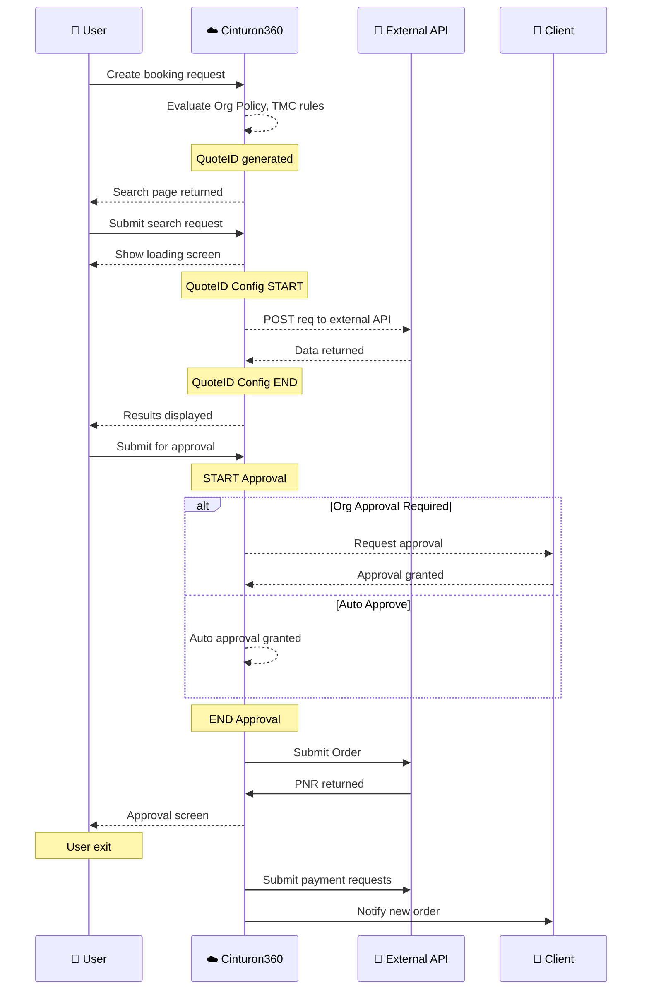

## My Diag

    <!--
    participant Q as 🔁 Message Queue
    participant N as 🔔 Notification Service
    participant St as 💳 Stripe
    participant Tmc as 🏢 TMC
    participant S as ⚙️ Background Worker
    -->
