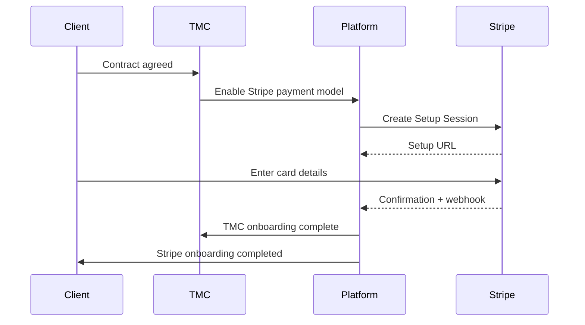

## Example scenario (BCA)

- Vendor: `{Vendor_Legal_Name}`
- TMC: `{TMC_Legal_Name}` / `{TMC_Trading_Name}`
- Client: Big Company A Pty Ltd (BCA)
- Billing contact email: `{Client_Billing_Email}`
- Payment processor: Stripe
- Merchant of record: `{Merchant_Of_Record}` (commonly the TMC; contract-dependent)

## Contract selection and model agreement

During commercial negotiation, the TMC and Client agree:

- payment model: Stripe
- payment terms if applicable (may still exist for reporting even when card-based)
- whether travel is auto-approved up to thresholds
- service fee schedules and late fee rules (if applicable)
- dispute and reconciliation processes
- revocation channel and notice requirements

These terms define the **Approved Travel Charges** concept used in both billing and legal authorisation documents.

## Required steps (detailed)

### Step 1: TMC enables Stripe for the Client relationship

On the Client account:

- Payment Model = Stripe
- Payment Terms = (optional) Net X (for internal reporting)
- Billing Contact = `{Client_Billing_Email}`
- Legal Template = Default hosted terms **or** a selected custom uploaded agreement

### Step 2: Platform generates authorisation request

The platform creates an “authorisation package” containing:

- the legal terms (default hosted template or custom agreement)
- a unique request identifier
- a validity period (optional; implementation-dependent)
- the revocation channel information
- references to the Client relationship and TMC

### Step 3: Client accepts authorisation terms

Client acceptance is usually captured via clickwrap-style acceptance in the portal UI or via hosted acceptance flow.

Evidence captured MUST include at minimum:

- accepted by (name/email/role)
- acceptance timestamp
- the exact rendered terms presented
- the version/hash of the template used
- the Client–TMC relationship identifier

### Step 4: Platform creates Stripe Setup Session

After acceptance, the platform creates a Stripe Setup Session (or equivalent setup flow) to capture and store a payment method for off-session use.

Output of this step includes:

- Stripe customer identifier (linked to the Client relationship)
- Stripe setup session identifier
- hosted setup URL

### Step 5: Platform emails the billing contact

The platform emails `{Client_Billing_Email}` with:

- the setup link
- context explaining it is for “as-required” travel charges
- how revocation works
- support contact details

### Step 6: Client enters payment details in Stripe-hosted UI

The Client uses the hosted Stripe UI to enter payment details.

The platform MUST ensure the hosted UI is on Stripe (or the payment processor), not on Cinturon360, to avoid handling card details directly.

### Step 7: Stripe confirms stored payment method

The platform receives confirmation (typically via webhook) and marks:

- Payment Method On File = true
- Default Payment Method = set (per relationship)
- Relationship Billable via Stripe = true (subject to final billability checks)

### Step 8: Billability verification

Before marking billable, the platform checks:

- account is not locked/delinquent
- threshold rules do not prohibit auto-approve behaviour
- prepaid/postpaid mode and balance configuration (if prepaid)
- the stored payment method is usable for off-session charges
- contract requires any additional prerequisites

## Process diagram (Stripe onboarding)

## Replacements and re-onboarding

If the payment method expires, is revoked, or becomes unusable:

- billing is suspended for Stripe charges until replaced
- a new authorisation request may be required depending on contract and policy
- a new setup session is issued to capture replacement credentials

See: [Stripe Re-onboarding and Replacement](stripe-reonboarding-and-replacement.md)
