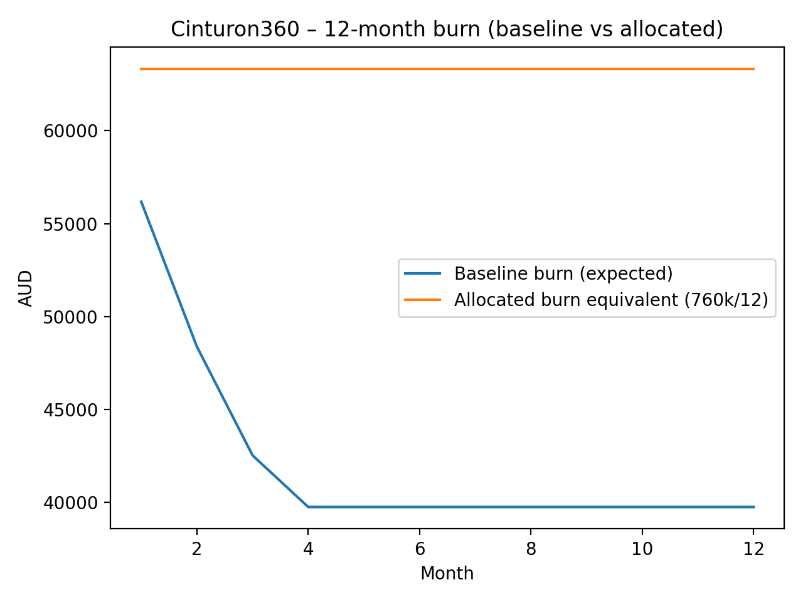
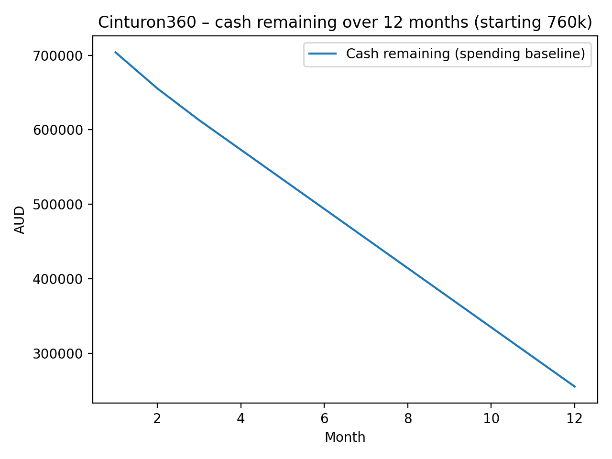

# Cinturon360 – Engineering & Platform Budget (12 Months)

## Scope
This document covers **my portion** of the funding plan: engineering delivery + platform operations for 12 months.

Included:
- Lead Architect (Australia) compensation and employer on-costs (NSW)
- India engineering team (direct hires, fully-loaded)
- Developer hardware and workstation setup
- **Infrastructure split by environment**:
  - **Production (Azure)**
  - **DEV (Azure)**
  - **UAT (Hetzner)**
  - shared monitoring/logging/backup
- Software licensing & tooling
- Platform integrations & external services
- Legal, accounting & compliance
- Operational contingency reserve (explicitly held as buffer runway)

Excluded (handled elsewhere):
- Sales/marketing spend
- Founder distributions beyond stated salary
- Travel, events, customer acquisition
- Dedicated office lease (if later needed, treat as a separate add-on line)

All figures in **AUD**.

---

# 1) Budget Summary (Baseline vs Buffer)

**Baseline = expected spend** (realistic plan).  
**Buffer = risk coverage** (retention, pricing variance, scaling, unknown integration costs).  
**Total allocation = Baseline + Buffer** (requested funds for this scope).

## Totals
- **Baseline expected spend:** **$504,860**
- **Buffer / contingency allocated:** **$255,140**
- **Total allocation (12 months):** **$760,000**

---

## 1.1 Line-item totals (high level)

| Category | Baseline | Buffer | Total |
|---|---:|---:|---:|
| Lead Architect (AU) – salary + on-costs | 190,910 | 9,090 | 200,000 |
| Engineering Team (India) – 1 Senior + 3 Mid (fully-loaded) | 155,250 | 24,750 | 180,000 |
| Developer hardware – laptops + desks (monitors/peripherals) | 19,500 | 5,500 | 25,000 |
| Infrastructure – Prod (Azure) | 30,000 | 15,000 | 45,000 |
| Infrastructure – DEV (Azure) | 12,000 | 6,000 | 18,000 |
| Infrastructure – UAT (Hetzner) | 4,800 | 2,200 | 7,000 |
| Monitoring/Logging/Backup – shared | 8,400 | 4,600 | 13,000 |
| Software licensing & tooling | 14,000 | 6,000 | 20,000 |
| Platform integrations & external services | 45,000 | 15,000 | 60,000 |
| Legal, accounting & compliance | 25,000 | 10,000 | 35,000 |
| Operational contingency reserve | 0 | 157,000 | 157,000 |

---

# 2) Staffing (VERY Detailed)

## 2.1 Lead Architect (Australia, NSW)

### Role coverage
Delivery:
- Architecture, domain modeling, multi-tenant boundaries, platform tenancy model
- API design and hardening (ASP.NET Core Web API)
- UI delivery strategy (Blazor Server) and shared component design
- Build/release orchestration and operational readiness

Platform:
- Security posture: secret handling, least privilege, audit logging patterns
- Deployment discipline (versioning, migrations, rollback strategy)
- Incident response ownership, SLO definition, operational metrics ownership

Integration ownership:
- Travel distribution integration work (NDC/GDS/aggregators) orchestration
- Billing and payment flow design (Stripe Connect model)
- Vendor onboarding workflows and environment management

### Included in baseline
- Gross salary
- Employer superannuation
- Workers compensation (high estimate)

### Buffer rationale
- Insurance/admin variance
- Minor payroll drift (rate changes, compliance costs)
- Minimal flexibility for short tactical assistance

**Allocation**
- Baseline: **$190,910**
- Buffer: **$9,090**
- Total: **$200,000**

---

## 2.2 India Engineering Team (Direct hires)

### Team model (4 engineers)
- 1 Senior Engineer: technical delivery lead, PR quality gate, integration reliability
- 3 Mid Engineers: feature delivery throughput, backlog execution, test coverage expansion

### Engagement model
- Direct hiring (no agency margin)
- Timezone overlap minimum target: 2–4 hours/day (AU ↔ India)
- Weekly cadence: planning → delivery → demo → retro
- Daily: async standup + overlap window for pairing/review

### Quality controls (how we ensure “on par with AU”)
- Paid technical assessment + paid trial sprint for finalists
- Mandatory code review (no direct-to-main)
- “Definition of done” includes: tests where applicable, logging, and acceptance criteria
- Structured PR templates (why/change/risk/rollout)
- Ownership model: each engineer owns a set of services/components

### Included in baseline
- Salaries
- Employer overhead modeled as ~15% (statutory + payroll admin)

### Buffer rationale
- Retention adjustments for top performers
- Backfill costs if replacement needed
- Short overlap to avoid delivery interruption

**Allocation**
- Baseline: **$155,250**
- Buffer: **$24,750**
- Total: **$180,000**

---

# 3) Hardware & Workstations (VERY Detailed)

## 3.1 Included equipment (per engineer)
Compute:
- MacBook Pro class laptop (dev-spec)

Desk setup:
- Dual monitors (productivity standard)
- Docking station + power + cables/adapters
- Keyboard + mouse
- Headset suitable for constant calls
- Optional: monitor arms, spare adapters, webcam

## 3.2 Operational approach
- Standard “golden setup” checklist to reduce setup time
- Spare hardware kept to prevent downtime
- Replace/repair policy to avoid dev stoppage

## 3.3 Buffer rationale
- Hardware failures and replacements
- Quick onboarding if adding headcount
- Peripherals are the most common failure/replace items

**Allocation**
- Baseline: **$19,500**
- Buffer: **$5,500**
- Total: **$25,000**

---

# 4) Infrastructure (EXTREMELY Detailed)

## 4.1 Why 3 environments are non-negotiable
- **DEV**: rapid iteration and integration testing without customer risk
- **UAT**: release rehearsal and acceptance testing (prevents production surprises)
- **PROD**: reliability-first with tighter controls and monitoring

This separation reduces:
- outage probability
- data corruption risk
- integration regressions
- release anxiety and slowdowns

---

## 4.2 Production (Azure) – detailed component breakdown

### Compute
- Web/API hosting (App Service or container hosting)
- Background job hosts (scheduled and queue-based workloads)
- Autoscaling posture (manual early, automatic as needed)

### Data
- PostgreSQL (managed where feasible) sized for:
  - transactional writes
  - multi-tenant query patterns
  - reporting and export workloads
- Optional cache layer (Redis) for:
  - rate limit caches
  - session/temporary state
  - hot lookup caches (if needed)

### Storage
- Blob/object storage for:
  - receipts, documents, exports
  - artifact storage and generated reports
- Backup storage:
  - daily backups + retention windows
  - restore verification posture

### Security
- Key Vault for secrets
- Least privilege identities for all services
- Environment isolation via resource grouping and access controls
- Public endpoints minimized
- Network rules to restrict DB access paths

### Observability
- Metrics: latency, error rates, saturation, DB health
- Logs: structured logs with correlation IDs
- Traces: request-level correlation where valuable
- Alerts: error spikes, latency, saturation thresholds, DB failures
- Incident routing: notification hooks (email/teams/etc)

### Cost drivers / variance sources
- DB tier shifts (IOPS, storage)
- log volume and retention duration
- outbound traffic (APIs + downloads)
- redundancy level (number of instances)

### Buffer rationale
- Covers initial customer load and growth uncertainty
- Covers log retention expansion during incident root cause analysis
- Covers DB tier increase as data grows

**Allocation**
- Baseline: **$30,000**
- Buffer: **$15,000**
- Total: **$45,000**

---

## 4.3 DEV (Azure) – detailed component breakdown

Purpose:
- Fast iteration and CI-driven feedback loops

Includes:
- Smaller compute footprint
- Dev DB sized for developer load and automated tests
- Reduced retention settings vs prod
- Frequent rebuild capability (infrastructure as code posture)

Buffer rationale:
- CI spikes (build/test)
- Additional services introduced during integrations
- Temporary parallel environments for testing

**Allocation**
- Baseline: **$12,000**
- Buffer: **$6,000**
- Total: **$18,000**

---

## 4.4 UAT (Hetzner) – detailed component breakdown

Purpose:
- Stable pre-prod environment
- Acceptance testing and release rehearsal

Includes:
- Production-like app footprint
- UAT database seeded from sanitized data or synthetic fixtures
- Backups sufficient for UAT rollback/recovery
- Minimal but sufficient monitoring and logs

Buffer rationale:
- Storage growth during integration testing
- Backup expansion
- Temporary scale-up during release rehearsal

**Allocation**
- Baseline: **$4,800**
- Buffer: **$2,200**
- Total: **$7,000**

---

## 4.5 Shared monitoring/logging/backup – detailed

Includes:
- Central log ingestion (apps + infra)
- Dashboarding (SLO-level visibility)
- Alert policies (error, latency, saturation, DB health)
- Trace sampling and correlation
- Backup retention storage and lifecycle rules

Buffer rationale:
- Higher log volume during integration phases
- Longer retention when diagnosing production issues
- Additional alert channels and tooling add-ons

**Allocation**
- Baseline: **$8,400**
- Buffer: **$4,600**
- Total: **$13,000**

---

## 4.6 Infrastructure totals
- Baseline: **$55,200**
- Buffer: **$27,800**
- Total allocation: **$83,000**

---

# 5) Software Licensing & Tooling (VERY Detailed)

## Tooling categories
Engineering:
- IDEs and developer productivity tooling
- Source control + PR workflows
- CI/CD: build, test, publish pipelines
- Artifact storage and build signing (where needed)

Quality and security:
- Dependency scanning and vulnerability management
- Optional SAST tooling if diligence requires it
- Linting/format and coding standard enforcement

Operations:
- Incident and alert management tooling as required

Buffer rationale:
- Team expansion
- Security tooling required by enterprise prospects or investors
- Additional CI minutes / runners to reduce cycle time

**Allocation**
- Baseline: **$14,000**
- Buffer: **$6,000**
- Total: **$20,000**

---

# 6) Platform Integrations & External Services (VERY Detailed)

## What this bucket is for
This category intentionally acknowledges “real life” integration spend:
- Transactional email provider (auth, booking notifications, receipts)
- DNS and domain operations
- Identity/auth provider add-ons if used
- Telephony/SMS if required for traveler communication
- Travel API onboarding costs and environment requirements
- Vendor-driven testing requirements and “surprise” environment needs
- Increased logging retention during integration troubleshooting
- WAF/rate limiting/audit expansion if vendor or customer requires it

Buffer rationale:
- Vendor pricing changes and onboarding requirements
- Integration-specific infrastructure needs
- Unexpected third-party services introduced during delivery

**Allocation**
- Baseline: **$45,000**
- Buffer: **$15,000**
- Total: **$60,000**

---

# 7) Legal, Accounting & Compliance (VERY Detailed)

Includes:
- Contracts: employment/contractor agreements, vendor agreements
- Privacy: data handling posture documentation, policy drafting
- Compliance: baseline diligence artifacts (investor requests)
- Accounting/bookkeeping: monthly bookkeeping, annual returns as required
- Insurance: baseline business coverage where needed

Buffer rationale:
- Investor diligence and legal document iterations
- Vendor/customer contract work
- Privacy/compliance expansion as integrations mature

**Allocation**
- Baseline: **$25,000**
- Buffer: **$10,000**
- Total: **$35,000**

---

# 8) Operational Contingency Reserve (VERY Detailed)

This is intentionally **not assumed spent** in baseline.

Primary uses:
- Integration surprises (vendor requirements, testing costs, contract deltas)
- Infrastructure scale events (DB tier jump, retention jump)
- Talent events (replacement hire, overlap)
- Acceleration (add 1–2 engineers if traction is strong)

How to present:
- “Explicit reserve to prevent runway erosion and eliminate funding-cliff risk.”

**Allocation**
- Baseline: **$0**
- Buffer: **$157,000**
- Total: **$157,000**

---

# 9) Burn Rate & Runway (Charts + Tables)

## 9.1 Baseline monthly burn table (AUD)
| Month | Baseline Burn | Cash Remaining (starting 760k) |
|---:|---:|---:|
| 1 | 56,180 | 703,820 |
| 2 | 48,380 | 655,440 |
| 3 | 42,530 | 612,910 |
| 4 | 39,752 | 573,158 |
| 5 | 39,752 | 533,406 |
| 6 | 39,752 | 493,653 |
| 7 | 39,752 | 453,901 |
| 8 | 39,752 | 414,149 |
| 9 | 39,752 | 374,397 |
| 10 | 39,752 | 334,644 |
| 11 | 39,752 | 294,892 |
| 12 | 39,752 | 255,140 |

## 9.2 Burn chart

## 9.3 Cash remaining chart (baseline spend)

---

# 10) Investor-Relevant Section (EXTREMELY Detailed)

## 10.1 Slide-ready “Use of Funds” paragraph
This allocation funds a 12-month engineering and platform execution plan to deliver Cinturon360’s product foundations:
- multi-tenant SaaS platform build-out
- production-grade infrastructure with DEV/UAT/Prod separation
- disciplined release management and operational readiness
- controlled-risk travel-industry integration delivery
- explicit reserve to de-risk execution and prevent runway erosion

## 10.2 Why Azure for Production (investor framing)
- Enterprise-aligned platform choice
- Strong governance posture (secrets, identities, RBAC)
- Mature managed services portfolio
- Easier diligence conversations for enterprise prospects

## 10.3 Why Hetzner for UAT (investor framing)
- Cost-efficient pre-prod environment
- Keeps acceptance testing and release rehearsal reliable
- Prevents UAT costs from inflating Azure production spend

## 10.4 How this reduces execution risk
- Multi-environment strategy prevents “testing in production”
- Central monitoring reduces MTTR and prevents silent failures
- Explicit buffers prevent the typical early-stage funding cliff
- Hiring model optimizes throughput per dollar without sacrificing quality

## 10.5 Buffers mapped to known risk vectors
- Integration buffer → vendor onboarding/pricing variance
- Infra buffer → scale, retention, DB tier variance
- Staffing buffer → retention/backfill and overlap
- Legal buffer → diligence + contracts
- Reserve → unknown unknowns + acceleration option

## 10.6 Suggested investor KPIs
Delivery:
- sprint throughput and cycle time
- deployment frequency and lead time
- defect rate and escaped defect rate

Reliability:
- uptime, latency, and error rate SLOs
- MTTR and incident frequency

Unit economics:
- infra cost per active tenant
- integration cost per provider onboarded

## 10.7 Milestone framing (replace with your roadmap)
- M1–M2: platform skeleton + CI/CD + environment parity
- M2–M4: core multi-tenant billing + policy enforcement
- M3–M6: first travel integration end-to-end workflows
- M6–M9: hardening + monitoring + DR posture improvements
- M9–M12: onboarding readiness + operational maturity for early customers

---

# Appendix A — Slide deck numbers (quick grab)
- **Total allocation (12 months): 760,000**
- **Baseline expected spend: 504,860**
- **Total buffer/reserve: 255,140**
- **Baseline burn (avg modeled): 42,072 / month**
- **Allocated burn equivalent: 63,333 / month**
